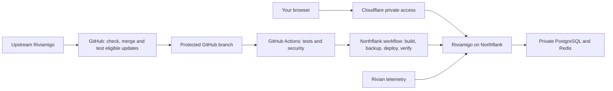

# GitHub and Northflank release pipeline

Documentation impact: internal and documentation-site update required.

For automatic off-provider backups and deletion safeguards, see
[vehicle history protection](private-history-backups.md).

The release pipeline is independent of KiRoom. GitHub runs the existing
**Fork validation** workflow. A successful push or explicit CI dispatch on the protected
`hardening/private-telemetry` branch starts **Queue verified Northflank release**
from `.github/workflows/fork-cd.yml`. That job rechecks the exact SHA, repository,
workflow identity, branch protection and both required jobs before calling a
workflow-specific Northflank webhook.



GitHub handles eligible stable upstream updates automatically. Conflicts and
security, existing-fork-patch or migration changes stop for review. KiRoom is an
optional tool for those exceptions; it does not hold up an eligible update or
need to remain running for the app or pipeline.
The former 15-minute deployment trigger must remain disabled.

## Where to inspect it

- GitHub: **Actions → Fork validation** and **Queue verified Northflank release**.
- GitHub: **Settings → Environments → northflank-production**. Its deployment
  branch rule permits only `hardening/private-telemetry`.
- Northflank: **riviamigo-private → Workflows → riviamigo-verified-release**.
  This is the authoritative final release result.
- Northflank: **Jobs → verified-release-controller** for the deployment step.
- Cloudflare: the existing `riviamigo-private` Worker and private-access policy.

The GitHub release job reports **queued**, not **deployed**. Northflank continues
after that job exits and records each stage's success or failure. The combined
app service's generic CI toggle remains off deliberately: builds and deployment
are controlled by the verified workflow, preventing an unchecked push from
deploying through a second path.

## Stages and source

The independent deployment module is in `scripts/native-release/`:

1. `guard.sh` verifies current protected-branch CI, approved migration identities,
   collector health, idle trip state and the Cloudflare/origin authentication gates.
   It creates a private attempt marker and retains aggregate data counts and
   fingerprints of the existing keys.
2. Northflank builds the exact SHA using the existing app service. The only build
   argument added is the nonsecret `RIVIAMIGO_RELEASE_SHA`. The image stores it in
   `/app/release-sha` so verification cannot mistakenly inspect an older container.
3. The guard rechecks CI and takes a fresh custom-format PostgreSQL backup,
   verifies its archive listing and SHA-256, then checks the database again.
4. The fixed deployment job uses Northflank's deployment API to pin the exact
   successful build ID. It checks the configured free allocation, observed zero
   billing usage, current protected commit and a backup attestation less than
   two minutes old before changing the image.
5. After rollout, the guard verifies the image's SHA, unchanged keys,
   authentication gates, complete migration ledger, retained history counts,
   credential count and collector reconnection. Only then does it record success
   and clear the attempt marker.

`render.mjs` renders the workflow; `job.mjs` renders the fixed controller job.
`wait.sh` runs each guard asynchronously on the existing app container. Northflank's
synchronous execute step stops waiting after 15 seconds, which can interrupt
orchestration even when a backup completes successfully. A short preparation
step creates a unique private operation; dispatch starts the guard; bounded
five-second polls await its atomic completion record. Remaining polls skip after
completion. An unconditional collector requires the exact successful guard
result before the next release stage can run.

Each operation has a five-minute deadline and a process-group timeout.
Failed, missing, mismatched or expired results stop the release. Operation IDs
prevent reruns from accepting an earlier result. The collector preserves the
original backup timestamp; the deployment job still requires a backup less than
two minutes old. Runtime state stays under `/backups/native-release/async/` on
the existing volume. No new service, credentials, schedule or application API
is needed. A dispatched command may outlive a cancelled workflow until its
deadline; inspect its lock and retained attempt before retrying.

The job bundles reviewed Python code and a digest-pinned official Python image.
It never checks out or executes scripts from a release candidate. Northflank's
native release-from-build-service node rejects combined services, so this small
job performs the supported deployment API operation without introducing another
always-running service.

The installed workflow and job are reviewed deployment policy. Ordinary app
releases do not replace them. Changes to this module require tests and a deliberate
installation of the rendered definitions; source edits alone do not change the
running controller.

## Credentials and free allocation

The release job receives only `NORTHFLANK_RELEASE_WEBHOOK` from the protected
production environment. Its temporary `GITHUB_TOKEN` is read-only and is sent only to GitHub.
No Rivian keys, database connection strings, database dumps or Northflank API
token are stored in GitHub.

The separate `upstream-automation` environment holds a repository-scoped SSH
deploy key for candidate publication. Only trusted default-branch preparation
can access it; candidate tests and this release job cannot. See
[private fork maintenance](private-fork-maintenance.md#candidate-push-credential).

The deployment token is a secret in the isolated Northflank controller job.
The app does not receive it. The job reads resource metadata and changes only the
existing app's pinned deployment. Treat access to that job and its token as
administrative access; use a dedicated restricted Northflank token when available.
The webhook can start only the installed workflow, whose guards reject arbitrary
commits. Do not disclose the webhook URL or print full API responses.

The installation uses the existing two `nf-compute-20` services, one private
database and one app volume, plus one `nf-compute-20` job within the included job
allowance. The job has no schedule, no retries, a 720-second deadline and no volume.
Workflows queue sequentially. Nothing scales resources or enables paid backups.
The deployment step rejects changed resource allocation or nonzero reported usage.
These checks do not promise future provider pricing.

## Backup and recovery

New automatic backups are on the existing Northflank app volume:

```text
/backups/native-release/<full-commit-sha>/
  database.dump
  database.sha256
  database.toc
  keys.sha256
  before.json
  before-deploy.json
  after.json
  success
```

The dump contains private vehicle and account data. It is not a public artifact.
Key fingerprints cannot replace the original RSA/JWT and AGE keys: retain those
in the existing secret configuration and private recovery copy. Earlier
pre-upgrade backups and the original runtime recovery file remain in the
private administrator recovery folder recorded during installation.

Before a backup, the guard requires free space for three times the current
database size plus 128 MiB. It stops rather than expanding storage or deleting
history. Archives accumulate within the existing volume; review retention and
keep an independent recovery copy. The automatic archive listing and checksum
check are not a full restore test. Full restore testing uses an isolated database
without an app or connection to Rivian.

A failed build or release can leave `/backups/native-release/attempt`. Later
runs fail closed until an administrator reconciles the live image, ledger and
recovery evidence. A failure after deployment may already have applied migrations;
never use an automatic image-only rollback. Recovery requires the matching
database backup, original keys and previous immutable image.

## Upstream changes and verification

`config/native-release-catalog.json` is an explicit approved migration ledger.
CI checks it against the SQL migration bytes, and the installed guard checks the
candidate's copy against its installed approval. An update that changes migration
identities stops for an upgrade/recovery review and controller-policy update.
Ordinary bug fixes can pass through without that extra step.

The tests cover GitHub token isolation, wrong/failed/stale CI, input injection,
missing/stale backups, changed keys, active trips and wrong image identity. The
shell guard tests use a real PostgreSQL container with synthetic HTTP, keys and
data on an isolated network. They do not contact Rivian or cloud accounts.

```sh
node --test scripts/fork-native-release.test.mjs scripts/northflank-deploy.test.mjs
```
